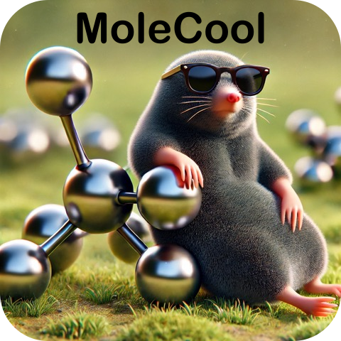

# MoleCool



A python package for molecular laser cooling and spectra simulation.

## Installation

The project can be installed using \`pip\`:

```
$ pip install MoleCool
```

To install from this repo:

```
$ git clone github.com/LangenGroup/MoleCool
$ cd MoleCool
$ pip install .
```

## Usage

The project offers a wide collection of examples that can directly be tested via:

```
$ python -m MoleCool.run_examples
```

### Information

This python software includes two different programs:

1. Molecular Dynamics Simulation

   - The first code only uses pre-defined constants (like the dipole matrix, hyperfine freqs, g-factors, …) from a .json file.
   - With these the dynamics via the rate or optical Bloch equations can be calculated.

2. Molecular Spectra Calculation

   - In comparison, the second code only uses constants of the effective Hamiltonian and Quantum numbers of the level structure.
   - By diagonalizing the Hamiltonians, the electric dipole matrix or branching ratios can be calculated to simulate molecular spectra.
     - With this comes alse hyperfine frequencies, g-factors, ... which are needed for the dynamics simulation code.

## Documentation

For full documentation see ...
