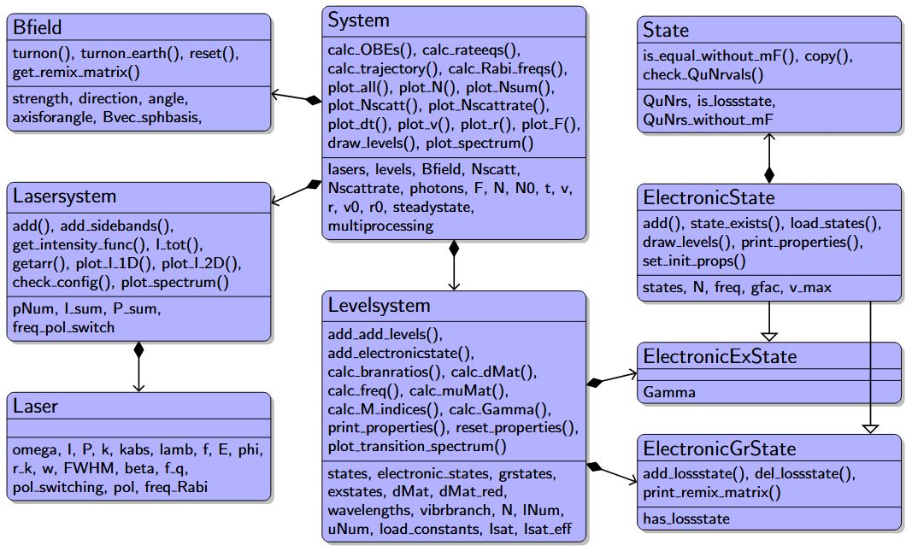

Getting started
===============

Overview
--------

Code structure of main modules
^^^^^^^^^^^^^^^^^^^^^^^^^^^^^^

   
   Class diagram of the **Dynamics Simulation Code**.
   While methods are characterized by parentheses, attributes and properties
   are labeled without parentheses. Class composition is marked by arrows with
   diamonds and class inheritance by open arrow tip.

The user guide provides a more detailed walkthrough of MoleCool’s
features and usage.

Lesson 1
--------

here some text:
- step 1
- step 2

Lesson 2
--------

another text....